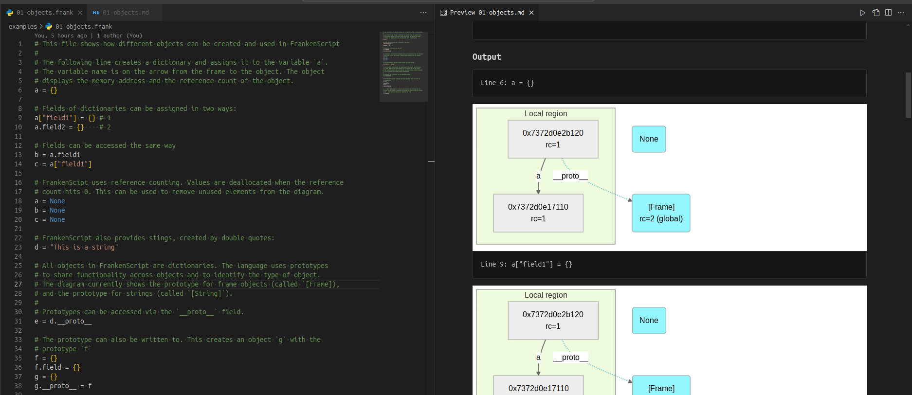

# PLDI25 Artifact: FrankenScript

This contains the supporting artefact for the paper "Dynamic Region Ownership
for Concurrency Safety". The artefact is a Docker script that builds the toy
programming language "FrankenScript" that interprets programs written in the
minimal FrankenScript language and outputs diagrams showing the heap of the
programs, an in particular the region-based ownership structure, object
membership in regions, immutable objects, etc. The FrankenScript interpreter
executes programs line-by-line and outputs a single markdown file with one
diagram for the state after each line of the program.

This docker container fetches and builds the commit
[`f62016b`](https://github.com/fxpl/frankenscript/tree/f62016b1a4ae42aa7e4554818734b44f9a8d9519)
which is available
on [GitHub](https://github.com/fxpl/frankenscript).

## Getting Started

FrankenScript is a dynamic toy language with Python like syntax. It is used to
visually explain how our proposed dynamic region ownership works. We provide
several examples as part of FrankenScript. Later sections will also show how
the artifact can be used interactively.

### Building the container

The instructions assume a working installation of Git and Docker. It also
requires a Markdown with support for Mermaid Diagrams[^1^]. We recommend
`VisualStudio Code` with the `Markdown Preview Mermaid Support`[^2^] plugin.
The container also provides a script for generating HTML files, but it is
slower than the Markdown output.

1. Checkout the artifact from GitHub:
    ```bash
    git clone https://github.com/microsoft/verona-artifacts
    cd verona-artifacts/frankenscript
    ```

2. Build the Docker image
    ```bash
    docker build -t frankenscript .
    ```

    This step can take several minutes depending on your internet connection.

    > Note: The Docker build step will install all the necessary packages and
    > build FrankenScript. However, it will not run any `.frank` scripts.

### Run Docker

The following command will run the Docker container and launch you inside the
Docker image:

```bash
mkdir -p artifact
cd artifact
docker run --cap-add=SYS_NICE -v $PWD:/artifact/output -it frankenscript
```

[^1^]: https://mermaid.js.org/
[^2^]: https://marketplace.visualstudio.com/items?itemName=bierner.markdown-mermaid

### Working with FrankenScript

When working with FrankenScript it is usually helpful to have the program and the
generated heap graphs (in mermaid format) side-by-side. Here is how this looks
like in a typical use case in our work, with VisualStudio Code and the
`Markdown Preview Mermaid Support`[^2^]:



The best way to get into FrankenScript is to work through the examples provided here:
[frankenscript/examples](https://github.com/fxpl/frankenscript/blob/main/examples).
The examples should be read in order of their file names. They are available in
the `./examples` directory in the Docker container. The examples contain several
references to the paper.

Useful resources:
* A legend for the created diagrams:
  [frankenscript/docs/frankenscript-legend.png](https://github.com/fxpl/frankenscript/blob/main/docs/frankenscript-legend.png)
* A list of all built-in functions:
  [frankenscript/docs/builtin.md](https://github.com/fxpl/frankenscript/blob/main/docs/builtin.md)
* Example 7 shows most available expressions:
  [frankenscript/examples/07-expressions.frank](https://github.com/fxpl/frankenscript/blob/main/examples/07-expressions.frank)

### Run individual files

The Docker image provides scripts to run individual files. The output will be
written to the `./artifact` directory on your local machine.

This will build the `./examples/01-objects.frank` script and generate a markdown file:

```bash
./fs.bash ./examples/01-objects.frank
```

You can use to generate the HTML version of the file. The HTML files load the
markdown JS plugin from Internet and renders the figures as a single file
interleaved with the lines of code that give rise to the subsequent figure.

```bash
/fs-html.bash ./examples/01-objects.frank
```

### Watching a file

FrankenScript is intended to be used interactively. The Docker image provides a
handy script to watch a file and rerun FrankenScript when the file is updated.

We recommend that you create a `watch.frank` file in the `./artifact` directory
of your local machine. In the Docker container you can then run:

```bash
./watch.bash ./output/watch.frank 
```

This will generate a `watch.md` file. VS Code will automatically reload the file
when it has been updated by FrankenScript.

Happy Hacking!

### Run all examples

The Docker image provides a script to run all examples from the `examples`
directory of FrankenScript:

```bash
./all-examples.bash
```

This will generate several Markdown files in the output directory of the Docker
container. This is mapped to the `./artifact` directory on your local machine.

If you want to generate the HTML files for all examples, you can use the following
alternative script:

```bash
./all-examples-html.bash
```

### Recreate the figures from the paper

The artifact contains scripts to recreate the figures from the paper. These are found
in the `./figures` directory. All of them can be recreated with the following command:

```bash
./all-figures.bash
```

This will generate several Markdown files in the output directory of the Docker
container. This is mapped to the `./artifact` directory on your local machine.

If you want to generate the HTML files for all figures, you can use the following
alternative script:

```bash
./all-figures-bash.bash
```

## Troubleshooting

This section covers some issues you might encounter while building or working with the artifact:

* **"Permission denied" when running Docker commands:**

    Dockers documentation explains how you can manage Docker as a non-root user:
    <https://docs.docker.com/engine/install/linux-postinstall/>
    You can also invoke all Docker commands as root, that should work just fine
    for FrankenScript.

* **Error when running FrankenScript in Docker:
  "Unable to open output file: /artifact/output/res/XYZ.md"**

    The `frankenscript` user might have lost permissions to write into the
    `./output` directory when it was mounted. You can manually allow access
    again with this command in Docker:

    ```bash
    sudo chown ubuntu -R /artifact/output
    ```

* **Missing permissions for files created from inside Docker:**

    All files created from Docker in the local `./artifact` directory should
    belong to your user. However, this might be different if you invoke Docker
    with `sudo` or have certain Linux features enabled.

    You should still be able to remove and modify the files with root privileges.
    It also often helps to create the files on your local machine first and only
    then access or update them from inside the Docker container.

---
